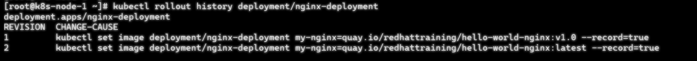
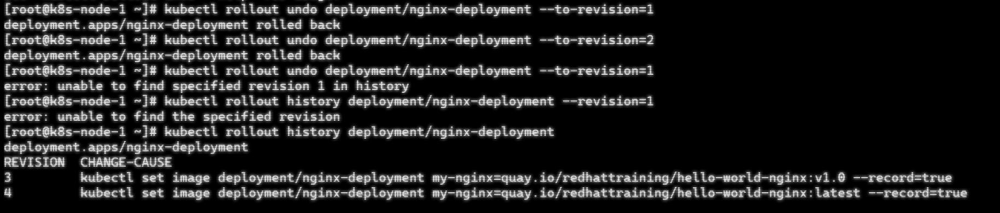
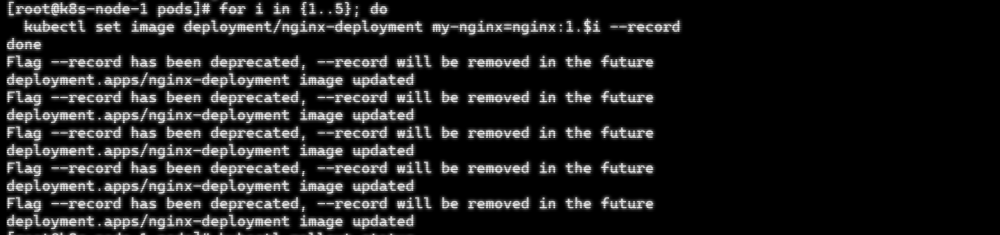
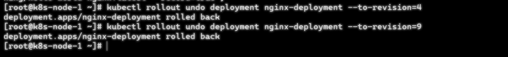
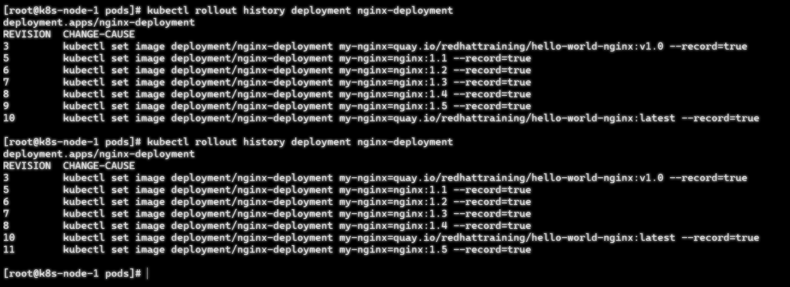

## 原本打算记录Deployment rollout undo回滚机制
## 环境信息（可复现）
- **K8s 版本**: v1.35.3 (kubectl client v1.35.3)
- **集群规模**: 一主两从测试环境
- **关键配置**:
```yaml
revisionHistoryLimit: 10      # 设置最多留存历史修改版本方便测试GC，回滚时有选择, 如果为0则不记录历史版本
strategy:
  rollingUpdate:
    maxSurge: 25%            # 更新时允许超出的比例
    maxUnavailable: 25%      # 最大不可用比例
terminationGracePeriodSeconds: 30  # 优雅停机， pod删除时最大宽限时间
```
## 意外发现
`kubectl rollout undo --to-revision=1` 执行后：
- 预期：回到 revision 1， 但revision 1 还在历史记录里
- 实际：**revision 1 消失了**，生成了新的 revision 3（3 的配置和 1 一样）
revision记录

回滚后

## 复现步骤
#### 1. 制造多个revision记录
```bash
for i in {1..5}; do
  kubectl set image deployment/nginx-deployment my-nginx=nginx:1.$i --record
done
```

查看revision记录

#### 2. 回滚验证
```bash
kubectl rollout undo --to-revision=4
kubectl rollout undo --to-revision=9
```

#### 3. 历史记录：revision 3, 5... 10（4,9 没了，出现了 10和11）

## 结论
Undo 不是"回到"某个版本，而是"基于某个版本创建新版本并**删除原版本号**"。反复 undo 会洗光历史。
