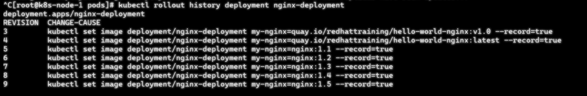

本来只是想测试下 Deployment 的 rollout undo 机制，结果发现一个反直觉的行为。

## 环境信息

- **K8s 版本**: v1.35.3
- **集群规模**: 一主两从测试环境
- **关键配置**:

```yaml
revisionHistoryLimit: 10
strategy:
  rollingUpdate:
    maxSurge: 25%
    maxUnavailable: 25%
terminationGracePeriodSeconds: 30
```

## 问题

执行 `kubectl rollout undo --to-revision=1` 后：

- **预期**: 回到 revision 1，且 revision 1 保留在历史记录里
- **实际**: revision 1 **消失了**，生成了新的 revision 3（配置和 1 一样）

revision 记录：


回滚后：


## 复现步骤

**1. 制造多个 revision**

```bash
for i in {1..5}; do
  kubectl set image deployment/nginx-deployment my-nginx=nginx:1.$i --record
done
```


查看 revision 记录：



**2. 回滚验证**

```bash
kubectl rollout undo --to-revision=4
kubectl rollout undo --to-revision=9
```


**3. 结果**

revision 3, 5... 10 还在，但 4 和 9 没了，取而代之的是 10 和 11：


## 结论

`undo` 不是"回到"某个版本，而是**基于该版本的配置创建一个新 revision，同时删掉被回滚的那个版本号**。反复 undo 会把历史版本号洗光。
