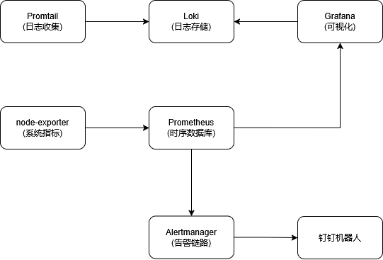
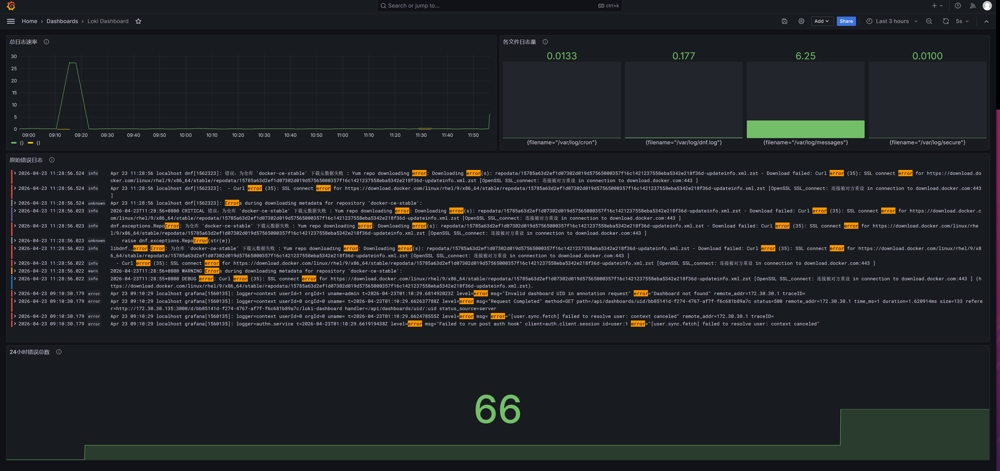

## 前言

最近在整理 homelab 的云原生技术栈，目标是能独立复现一套完整的可观测平台。本文记录从 0 到 1 的过程，包括踩过的坑和最终方案。

项目已开源：[github.com/wamudus/node-observability-baseline](https://github.com/wamudus/node-observability-baseline)

## 环境说明

- **宿主机**: RHEL 9 / Rocky Linux 9
- **容器运行时**: Podman + Podman Compose
- **网络**: 桥接网络 `observe`（`10.90.0.0/24`）
- **核心组件**:
  - Prometheus v2.51.2（指标采集）
  - Loki 3.4.1（日志聚合）
  - Grafana 10.4.2（可视化）
  - Promtail 3.4.1（日志采集）
  - Alertmanager v0.27.0（告警路由与抑制）
  - prometheus-webhook-dingtalk v2.1.0（钉钉告警适配）

## 仓库结构

```
.
├── docker-compose.yml          # 全栈编排定义
├── README.md                   # 项目文档
├── prometheus.yml              # Prometheus 抓取配置 & 告警接入
├── alert_rules.yml             # Prometheus 告警规则（CPU/内存/磁盘/只读）
├── node-randon.yml             # 文件服务发现配置（预留）
├── alertmanager.yml            # Alertmanager 路由 & 抑制规则
├── dingtalk.yml                # 钉钉 Webhook 配置
├── dingtalk.tmpl               # 钉钉消息 Markdown 模板源文件
├── loki-config.yaml            # Loki 存储 & 索引配置
├── promtail-config.yaml        # Promtail 日志抓取配置
└── grafana/
    └── provisioning/
        ├── dashboards/
        │   ├── dashboard.yml              # Dashboard 自动加载声明
        │   ├── 1860_rev45.json            # Node Exporter Full（社区成熟主机监控模板）
        │   └── Loki-Dashboard-fixed.json  # Loki 日志看板（变量化改造）
        └── datasources/
            └── datasource.yml             # 数据源自动加载声明
```

## 架构设计



**数据流说明：**
- **Metrics 链路**：Node Exporter 暴露 `:9100/metrics` → Prometheus 主动抓取 → Grafana 查询展示
- **Logs 链路**：Promtail 直接挂载宿主机 `/var/log` 采集日志 → 推送至 Loki → Grafana 查询展示
- **Alert 链路**：Prometheus 触发告警 → Alertmanager 路由/抑制 → DingTalk Webhook 推送

**网络设计：**
- 统一使用 `observe` Bridge 网络（子网 `10.90.0.0/24`），组件间通过服务名 DNS 解析通信
- 仅暴露必要端口：`9090` (Prometheus)、`3000` (Grafana)、`9093` (Alertmanager)、`3100` (Loki)、`8060` (Dingtalk)

## 核心配置

### 1. Docker Compose

相比初版，迭代版本补充了 **healthcheck** 和 **depends_on**，解决 Grafana 启动时数据源未就绪的问题：

```yaml
version: "3.8"
networks:
  observe:
    driver: bridge
    ipam:
      config:
        - subnet: 10.90.0.0/24

volumes:
  prometheus-data:
  grafana-data:
  alertmanager-data:
  loki-data:
  promtail-data:

services:
  prometheus:
    image: docker.io/prom/prometheus:v2.51.2
    container_name: prometheus
    networks:
      - observe
    ports:
      - "9090:9090"
    volumes:
      - prometheus-data:/prometheus
      - ./prometheus.yml:/prometheus/prometheus.yml:ro
      - ./alert_rules.yml:/prometheus/alert_rules.yml:ro
    command:
      - '--config.file=/prometheus/prometheus.yml'
      - '--storage.tsdb.path=/prometheus'
    restart: unless-stopped
    healthcheck:
      test: ["CMD", "wget", "--spider", "-q", "http://localhost:9090/-/healthy"]
      interval: 15s
      timeout: 5s
      retries: 3
    depends_on:
      - alertmanager

  node-exporter:
    image: docker.io/prom/node-exporter:v1.7.0
    container_name: node-exporter
    networks:
      - observe
    volumes:
      - /proc:/host/proc:ro
      - /sys:/host/sys:ro
      - /:/rootfs:ro
    command:
      - '--path.procfs=/host/proc'
      - '--path.sysfs=/host/sys'
    restart: unless-stopped

  alertmanager:
    image: docker.io/prom/alertmanager:v0.27.0
    container_name: alertmanager
    networks:
      - observe
    ports:
      - "9093:9093"
    volumes:
      - ./alertmanager.yml:/etc/alertmanager/alertmanager.yml:ro
      - alertmanager-data:/alertmanager
    restart: unless-stopped
    healthcheck:
      test: ["CMD", "wget", "--spider", "-q", "http://localhost:9093/-/healthy"]
      interval: 15s
      timeout: 5s
      retries: 3

  grafana:
    image: docker.io/grafana/grafana:10.4.2
    container_name: grafana
    networks:
      - observe
    ports:
      - "3000:3000"
    environment:
      - GF_SECURITY_ADMIN_USER=admin
      - GF_SECURITY_ADMIN_PASSWORD=admin
      - GF_USERS_ALLOW_SIGN_UP=false
      - GF_SERVER_ROOT_URL=http://localhost:3000
    volumes:
      - grafana-data:/var/lib/grafana
      - ./grafana/provisioning:/etc/grafana/provisioning:ro
      - ./grafana/provisioning/dashboards:/var/lib/grafana/dashboards:ro
    restart: unless-stopped
    healthcheck:
      test: ["CMD", "curl", "-f", "http://localhost:3000/api/health"]
      interval: 15s
      timeout: 5s
      retries: 3
    depends_on:
      - prometheus
      - loki

  loki:
    image: docker.io/grafana/loki:3.4.1
    container_name: loki
    networks:
      - observe
    ports:
      - "3100:3100"
    volumes:
      - ./loki-config.yaml:/etc/loki/local-config.yaml:ro
      - loki-data:/loki
    command: 
      - "--config.file=/etc/loki/local-config.yaml"

  promtail:
    image: docker.io/grafana/promtail:3.4.1
    container_name: promtail
    networks:
      - observe
    volumes:
      - promtail-data:/tmp/position
      - ./promtail-config.yaml:/etc/promtail/promtail-config.yaml
      - /var/log:/var/log:ro
    command:
      - "--config.file=/etc/promtail/promtail-config.yaml"

  webhook-dingtalk:
    image: docker.io/timonwong/prometheus-webhook-dingtalk:v2.1.0
    container_name: dingtalk
    networks:
      - observe
    ports:
      - "8060:8060"
    volumes:
      - ./dingtalk.yml:/etc/prometheus-webhook-dingtalk/config.yml
      - ./dingtalk.tmpl:/etc/prometheus-webhook-dingtalk/dingtalk.tmpl
```

### 2. Prometheus 抓取配置

迭代版本单独抽离了 `prometheus.yml`，明确声明抓取目标与告警接入：

```yaml
# my global config
global:
  scrape_interval: 15s
  evaluation_interval: 15s

# Alertmanager configuration
alerting:
  alertmanagers:
    - static_configs:
        - targets:
            - alertmanager:9093

# Load rules once and periodically evaluate them
rule_files:
  - "/prometheus/alert_rules.yml"

scrape_configs:
  - job_name: "prometheus"
    static_configs:
      - targets: ["localhost:9090"]
        labels:
          app: "prometheus"

  - job_name: "loki" 
    static_configs:
      - targets: ["loki:3100"]
        labels:
          app: "loki"

  - job_name: "node-exporter"
    static_configs:
      - targets: ["node-exporter:9100"]
        labels:
          app: "node-exporter"
```

### 3. Prometheus 告警规则

聚焦三个核心资源：CPU 看趋势、内存和磁盘看绝对剩余。**迭代版本去掉了 annotations 里的硬编码"告警"前缀**——模板层已经兜底，规则层保持干净：

```yaml
groups:
  - name: homelab-resources
    rules:
      - alert: CPUHighLoad
        expr: |
          (
            1 - 
            avg by(instance) (rate(node_cpu_seconds_total{mode="idle"}[5m]))
          ) > 0.85
        for: 5m
        labels:
          severity: warning
        annotations:
          summary: "CPU 长时间高负载"
          description: "主机 {{ $labels.instance }} CPU 非空闲占比超过 85%，持续 5 分钟。当前值: {{ $value | humanizePercentage }}"

      - alert: MemoryLow
        expr: (1 - (node_memory_MemAvailable_bytes / node_memory_MemTotal_bytes)) > 0.9
        for: 2m
        labels:
          severity: critical
        annotations:
          summary: "内存可用不足 10%"
          description: "主机 {{ $labels.instance }} 内存使用率超过 90%，剩余可用: {{ $value | humanizePercentage }}"

      - alert: DiskFull
        expr: (1 - node_filesystem_avail_bytes{mountpoint="/"} / node_filesystem_size_bytes{mountpoint="/"}) > 0.85
        for: 1m
        labels:
          severity: warning
        annotations:
          summary: "根分区使用率超过 85%"
          description: "{{ $labels.instance }} 根分区 / 使用率: {{ $value | humanizePercentage }}，即将写满"

      - alert: DiskCritical
        expr: (1 - node_filesystem_avail_bytes{mountpoint="/"} / node_filesystem_size_bytes{mountpoint="/"}) > 0.9
        for: 1m
        labels:
          severity: critical
        annotations:
          summary: "根分区使用率超过 90%"
          description: "主机 {{ $labels.instance }} 根分区 / 使用率: {{ $value | humanizePercentage }}，磁盘即将耗尽，请立即清理"

      - alert: DiskReadOnly
        expr: node_filesystem_readonly{mountpoint="/"} == 1
        for: 0m
        labels:
          severity: critical
        annotations:
          summary: "文件系统只读"
          description: "主机 {{ $labels.instance }} 根分区 / 变为只读，可能文件系统损坏或磁盘故障"
```

### 4. Alertmanager 路由与抑制

迭代版本新增了 `alertmanager.yml`，核心是两个能力：**路由分组**和**告警抑制**。

```yaml
route:
  group_by: ['alertname']
  group_wait: 30s
  group_interval: 5m
  repeat_interval: 1h
  receiver: 'web.hook'
receivers:
  - name: 'web.hook'
    webhook_configs:
      - url: 'http://dingtalk:8060/dingtalk/example/send'
inhibit_rules:
  - source_matchers: [severity="critical"]
    target_matchers: [severity="warning"]
    equal: [alertname, dev, instance]
```

**抑制规则的作用**：当同一实例的同一告警触发 Critical 时，自动静默其 Warning 级别通知，避免告警风暴。

### 5. Loki 与 Promtail

Loki 配置与初版一致，采用文件系统本地存储：

```yaml
auth_enabled: false

server:
  http_listen_port: 3100
  grpc_listen_port: 9096
  log_level: info
  grpc_server_max_concurrent_streams: 1000

common:
  path_prefix: /tmp/loki
  storage:
    filesystem:
      chunks_directory: /tmp/loki/chunks
      rules_directory: /tmp/loki/rules
  replication_factor: 1
  ring:
    kvstore:
      store: inmemory

schema_config:
  configs:
    - from: 2020-10-24
      store: tsdb
      object_store: filesystem
      schema: v13
      index:
        prefix: index_
        period: 24h

limits_config:
  allow_structured_metadata: true
  volume_enabled: true
  metric_aggregation_enabled: true

pattern_ingester:
  enabled: true
  metric_aggregation:
    loki_address: localhost:3100

frontend:
  encoding: protobuf
```

Promtail 采集宿主机系统日志：

```yaml
server:
  http_listen_port: 9080
  grpc_listen_port: 0

positions:
  filename: /tmp/position/positions.yaml

clients:
  - url: http://loki:3100/loki/api/v1/push

scrape_configs:
- job_name: system
  static_configs:
  - targets:
      - localhost
    labels:
      job: varlogs
      __path__: /var/log/{messages,secure,cron,dnf.log}
```

### 6. 钉钉告警（迭代重点）

初版踩了很多钉钉的坑，迭代版本把配置收敛为**"模板兜底 + 结构化 message"**。

**dingtalk.yml**：注意 `message` 是对象，不是字符串。

```yaml
templates:
  - /etc/prometheus-webhook-dingtalk/dingtalk.tmpl
targets:
  example:
    url: "https://oapi.dingtalk.com/robot/send?access_token=< your token >"
    message:
      title: '{{ template "dingtalk.default.title" . }}'
      text: '{{ template "dingtalk.default.content" . }}'
```

**dingtalk.tmpl**：模板层统一加前缀、带状态 emoji、支持恢复通知。

```tmpl
{{ define "dingtalk.default.title" }}
{{ if eq .Status "firing" }}🔴 告警触发{{ else }}🟢 告警恢复{{ end }}
{{ end }}

{{ define "dingtalk.default.content" }}
{{ range .Alerts }}
**告警名称**: {{ .Labels.alertname }}

**实例**: {{ .Labels.instance }}

**级别**: {{ .Labels.severity }}
{{ if eq .Status "firing" }}
**状态**: ⚠️ 触发中

**详情**: {{ .Annotations.description }}
{{ else }}
**状态**: ✅ 已恢复
{{ end }}
---
{{ end }}
{{ end }}
```

### 7. Grafana Provisioning 自动加载

迭代版本的核心改进：**所有 Dashboard 和数据源随 Grafana 启动自动导入**，无需手动操作。

**数据源声明**（`grafana/provisioning/datasources/datasource.yml`）：

```yaml
apiVersion: 1
datasources:
  - name: Prometheus
    type: prometheus
    access: proxy
    url: http://prometheus:9090
    isDefault: true
    editable: false

  - name: Loki
    type: loki
    access: proxy
    url: http://loki:3100
    editable: false
```

**Dashboard 自动加载声明**（`grafana/provisioning/dashboards/dashboard.yml`）：

```yaml
apiVersion: 1
providers:
  - name: 'default'
    orgId: 1
    folder: ''
    type: file
    disableDeletion: false
    editable: true
    options:
      path: /var/lib/grafana/dashboards
```

预置两块 Dashboard：
- **Node Exporter Full**（Grafana ID: 1860）：社区最成熟的主机监控模板，开箱即用
- **Loki-Dashboard-fixed**：针对 datasource 变量化改造，顶部下拉框自动发现 Loki 源，适配多环境

## Dashboard 展示

### 1. Node Exporter Full

直接采用社区最成熟的主机监控 Dashboard，通过 Provisioning 自动加载：

- **Quick CPU / Mem / Disk**：CPU 使用率、系统负载、内存、Swap、根分区占用
- **Basic CPU / Mem / Net / Disk**：时序趋势图，支持多维度下钻
- **Storage / Network / Systemd**：磁盘 I/O、网络包级分析、systemd 服务状态

### 2. Loki 日志看板

借鉴社区 Dashboard 导入原理，针对 datasource 变量化进行微调：

| 面板 | 类型 | 说明 |
|------|------|------|
| 总日志速率 | Time Series | 普通日志 vs 错误日志 5m 速率对比 |
| 各文件日志量 | Bar Gauge | 按 filename 聚合的日志速率 |
| 原始错误日志 | Logs | 实时 error 日志流，支持详情展开 |
| 24小时错误总数 | Stat | 近 24h 累计错误条数，带阈值变色 |

**优化点**：
- 摒弃 `__inputs` 导入映射，改为 `datasource` 查询变量，顶部下拉框自动发现所有 Loki 源
- `job` 标签变量化，从硬编码 `varlogs` 改为 `$job`，适配多环境日志源

**最终效果**



## 踩坑记录

### 坑 1: Dashboard 模板依赖 K8s 标签

导入社区模板（如 ID 13186）时，变量查询 `kube_pod_info`、`mixin_pod_workload` 等，裸机环境没有这些指标，全部为空。

**解决**: 自建 Dashboard，根据实际标签（job、filename）写 LogQL，不依赖 K8s 模板。

### 坑 2：/var/log/messages 日志自循环

Promtail 挂载 `/var/log` 后，messages 文件里包含了 Loki、Promtail、Grafana 自身的日志，导致查询 `|= "error"` 时产生自循环。

**解决**：LogQL 查询时排除自身进程：

```
{job="varlogs"} |~ "(?i)error" != "query=" != "caller=engine.go" != "caller=metrics.go" != "loki[" != "grafana[" != "promtail["
```

### 坑 3：钉钉 message 字段类型错误

`prometheus-webhook-dingtalk` 的 `message` 字段是**对象**，不是字符串。常见报错：

```
cannot unmarshal !!str into config.plain
```

**正确写法**：

```yaml
message:
  title: '{{ template "dingtalk.default.title" . }}'
  text: '{{ template "dingtalk.default.content" . }}'
```

### 坑 4：模板文件名与挂载路径不一致

如果 `dingtalk.yml` 里声明的模板路径和 `docker-compose.yml` 挂载的路径不一致，Docker 会静默创建目录，导致模板加载失败且没有任何错误日志。

**排查**：进容器确认文件存在。

```bash
podman exec -it dingtalk ls /etc/prometheus-webhook-dingtalk/
```

### 坑 5：模板引擎不支持 Alertmanager 扩展函数

`prometheus-webhook-dingtalk` 使用原生 Go template，**不支持** `humanizeDuration`、`since` 等 Alertmanager 函数。如果在模板里用了会直接 panic。

**解决**：模板里只使用原生 Go template 语法，复杂格式化在 Prometheus rule 的 annotations 里完成。

### 坑 6：Grafana 启动时 Loki 未就绪

`depends_on` 只保证启动顺序，不保证服务就绪。Grafana 启动时若 Loki 尚未监听 3100，数据源会被标记为 down。

**解决**：Loki 官方镜像基于 distroless，无法内置 healthcheck；启动后手动 `docker compose restart grafana` 即可刷新数据源状态。

## 链路验证

部署完成后，按这个顺序验证三条链路是否全部打通：

**1. Metrics 链路**
- Prometheus Targets 页面 (`:9090/targets`) 确认 `node-exporter:9100` 状态为 UP
- Grafana Explore 查询 `node_cpu_seconds_total` 能返回时序数据

**2. Logs 链路**
- Promtail 日志无报错，`/var/log/messages` 被正常推送
- Grafana Explore 选择 Loki 数据源，查询 `{job="varlogs"}` 能看到日志流

**3. Alerting 链路**
- 手动触发告警：临时调低 `alert_rules.yml` 中的阈值，让 CPU 告警 firing
- Alertmanager (`:9093`) 中能看到活跃告警
- 钉钉群收到测试告警消息，确认模板渲染和关键词过滤都正常

## 后续计划

目前这套是 Docker Compose 单节点版本，主要用来验证配置和快速演示。下一步计划通过 Ansible 拉起 3 节点 K8s 实验环境，将整套监控栈迁移至 K8s，使用 ConfigMap / Secret 管理配置，并引入 Prometheus Operator 做服务发现。
