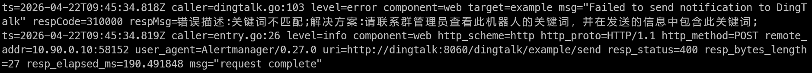

## 前言

最近在整理 homelab 的云原生技术栈，目标是能独立复现一套完整的可观测平台。本文记录从 0 到 1 的过程，包括踩过的坑和最终方案。

## 环境说明

- **宿主机**: RHEL 9 / Rocky Linux 9
- **容器运行时**: Podman + Podman Compose
- **网络**: 桥接网络 `docker-compose_observe`（`10.90.0.0/24`）
- **核心组件**:
  - Prometheus v2.51.2（指标采集）
  - Loki 3.4.1（日志聚合）
  - Grafana 10.4.2（可视化）
  - Promtail 3.4.1（日志采集）
  - Alertmanager v0.27.0（告警链路）

## 架构设计


## 核心配置
### 1. Docker Compose
```yaml
version: "3.8"
networks:
  observe:
    driver: bridge
    ipam:
      config:
        - subnet: 10.90.0.0/24

volumes:
  prometheus-data:
  grafana-data:
  alertmanager-data:
  loki-data:
  promtail-data:

services:
  prometheus:
    image: docker.io/prom/prometheus:v2.51.2
    container_name: prometheus
    networks:
      - observe
    ports:
      - "9090:9090"
    volumes:
      - prometheus-data:/prometheus
      - ./prometheus.yml:/prometheus/prometheus.yml:ro
      - ./alert_rules.yml:/prometheus/alert_rules.yml:ro
    command:
      - '--config.file=/prometheus/prometheus.yml'
      - '--storage.tsdb.path=/prometheus'
    restart: unless-stopped

  node-exporter:
    image: docker.io/prom/node-exporter:v1.7.0
    container_name: node-exporter
    networks:
      - observe
    volumes:
      - /proc:/host/proc:ro
      - /sys:/host/sys:ro
      - /:/rootfs:ro
    command:
      - '--path.procfs=/host/proc'
      - '--path.sysfs=/host/sys'
    restart: unless-stopped

  alertmanager:
    image: docker.io/prom/alertmanager:v0.27.0
    container_name: alertmanager
    networks:
      - observe
    ports:
      - "9093:9093"
    volumes:
      - ./alertmanager.yml:/etc/alertmanager/alertmanager.yml:ro
      - alertmanager-data:/alertmanager
    restart: unless-stopped

  grafana:
    image: docker.io/grafana/grafana:10.4.2
    container_name: grafana
    networks:
      - observe
    ports:
      - "3000:3000"
    environment:
      - GF_SECURITY_ADMIN_USER=admin
      - GF_SECURITY_ADMIN_PASSWORD=admin
      - GF_USERS_ALLOW_SIGN_UP=false
      - GF_SERVER_ROOT_URL=http://localhost:3000
    volumes:
      - grafana-data:/var/lib/grafana
      - ./grafana/provisioning:/etc/grafana/provisioning:ro
    restart: unless-stopped
    depends_on:
      - prometheus
      - loki


  loki:
    image: docker.io/grafana/loki:3.4.1
    container_name: loki
    networks:
      - observe
    ports:
      - "3100:3100"
    volumes:
      - ./loki-config.yaml:/etc/loki/local-config.yaml:ro
      - loki-data:/loki
    command:
      - "--config.file=/etc/loki/local-config.yaml"

  promtail:
    image: docker.io/grafana/promtail:3.4.1
    container_name: promtail
    networks:
      - observe
    volumes:
      - promtail-data:/tmp/position
      - ./promtail-config.yaml:/etc/promtail/promtail-config.yaml
      - /var/log:/var/log:ro
    command:
      - "--config.file=/etc/promtail/promtail-config.yaml"

  webhook-dingtalk:
    image: docker.io/timonwong/prometheus-webhook-dingtalk:v2.1.0
    container_name: dingtalk
    networks:
      - observe
    ports:
      - "8060:8060"
    volumes:
      - ./dingtalk.yml:/etc/prometheus-webhook-dingtalk/config.yml
      - ./dingtalk.tmpl:/etc/prometheus-webhook-dingtalk/dingtalk.tmpl
```
### 2. Loki 配置
```yaml
auth_enabled: false

server:
  http_listen_port: 3100
  grpc_listen_port: 9096
  log_level: info
  grpc_server_max_concurrent_streams: 1000

common:
  path_prefix: /tmp/loki
  storage:
    filesystem:
      chunks_directory: /tmp/loki/chunks
      rules_directory: /tmp/loki/rules
  replication_factor: 1
  ring:
    kvstore:
      store: inmemory

schema_config:
  configs:
    - from: 2020-10-24
      store: tsdb
      object_store: filesystem
      schema: v13
      index:
        prefix: index_
        period: 24h

limits_config:
  allow_structured_metadata: true
  volume_enabled: true
  metric_aggregation_enabled: true

pattern_ingester:
  enabled: true
  metric_aggregation:
    loki_address: localhost:3100

frontend:
  encoding: protobuf
```

### 3. Prometheus 告警规则
聚焦三个核心资源：CPU 看趋势、内存和磁盘看绝对剩余。
```yaml
groups:
  - name: homelab-resources
    rules:
      - alert: CPUHighLoad
        expr: |
          (
            1 -
            avg by(instance) (rate(node_cpu_seconds_total{mode="idle"}[5m]))
          ) > 0.85
        for: 5m
        labels:
          severity: warning
        annotations:
          summary: "告警 - CPU 长时间高负载"
          description: "告警 - 主机 {{ $labels.instance }} CPU 非空闲占比超过 85%，持续 5 分钟。当前值: {{ $value | humanizePercentage }}"

      - alert: MemoryLow
        expr: (1 - (node_memory_MemAvailable_bytes / node_memory_MemTotal_bytes)) > 0.9
        for: 2m
        labels:
          severity: critical
        annotations:
          summary: "告警 - 内存可用不足 10%"
          description: "告警 - 主机 {{ $labels.instance }} 内存使用率超过 90%，剩余可用: {{ $value | humanizePercentage }}"

      - alert: DiskFull
        expr: (1 - node_filesystem_avail_bytes{mountpoint="/"} / node_filesystem_size_bytes{mountpoint="/"}) > 0.85
        for: 1m
        labels:
          severity: warning
        annotations:
          summary: "告警 - 根分区使用率超过 85%"
          description: "告警 - 主机 {{ $labels.instance }} 根分区 / 使用率: {{ $value | humanizePercentage }}，即将写满"

      - alert: DiskCritical
        expr: (1 - node_filesystem_avail_bytes{mountpoint="/"} / node_filesystem_size_bytes{mountpoint="/"}) > 0.9
        for: 1m
        labels:
          severity: critical
        annotations:
          summary: "告警 - 根分区使用率超过 90%"
          description: "告警 - 主机 {{ $labels.instance }} 根分区 / 使用率: {{ $value | humanizePercentage }}，磁盘即将耗尽，请立即清理"

      - alert: DiskReadOnly
        expr: node_filesystem_readonly{mountpoint="/"} == 1
        for: 0m
        labels:
          severity: critical
        annotations:
          summary: "告警 - 文件系统只读"
          description: "告警 - 主机 {{ $labels.instance }} 根分区 / 变为只读，可能文件系统损坏或磁盘故障"
```
### 4. Alertmanager → 钉钉
使用prometheus-webhook-dingtalk做格式转换
```yaml
# dingtalk.yml
templates:
  - /etc/prometheus-webhook-dingtalk/dingtalk.tmpl
targets:
  example:
    url: "https://oapi.dingtalk.com/robot/send?access_token=xxxx"
```
## 踩坑记录
### 坑 1: Dashboard 模板依赖 K8s 标签
导入社区模板（如 ID 13186）时，变量查询 kube_pod_info、mixin_pod_workload 等，裸机环境没有这些指标，全部为空。

**解决**:  自建 Dashboard，根据实际标签（job、filename）写 LogQL。
不依赖 K8s 模板，5 个核心面板：

**最终效果**


**参数列表**
| 面板 | LogQL | 类型 | 说明 |
|------|-------|------|------|
| 总日志速率 | `sum(rate({job="varlogs"}[5m]))` | Time series | 每秒日志条数趋势 |
| 错误日志速率 | `sum(rate({job="varlogs"} \|~ "(?i)error" [5m]))` | Time series | 错误趋势 |
| 各文件日志量 | `sum by (filename) (rate({job="varlogs"}[5m]))` | Bar gauge | 哪个文件最活跃 |
| 24h 错误总数 | `sum(count_over_time({job="varlogs"} \|~ "(?i)error" [24h]))`  | Stat | 大数字, 显眼 |
| 原始错误日志	 | `{job="varlogs"} \|~ "(?i)error"` | Logs | 下钻看原文

### 坑 2：/var/log/messages 日志垃圾桶
Promtail 挂载 /var/log 后，messages 文件里包含了 Loki、Promtail、Grafana 自身的日志，导致查询 |= "error" 时产生自循环（查询产生日志 → 日志被采集 → 又被查询到）。

**解决**： LogQL 查询时排除自身进程：

| 面板 | LogQL | 类型 | 说明 |
|------|-------|------|------|
| 原始错误日志 | `{job="varlogs"} \|~ "(?i)error" != "loki[" != "grafana[" != "promtail["` | Logs | 下钻看原文

### 坑3 ：钉钉告警静默丢失
配完 Alertmanager → webhook-dingtalk → 钉钉机器人后，Alertmanager 日志显示发送成功，webhook-dingtalk 返回 `{"errcode":0,"errmsg":"ok"}`，但钉钉群里**永远收不到消息**。
#### 原因 1：Token 被当成纯字符串
在 `dingtalk.yml` 里直接写 `${DING_TOKEN}` 不会自动解析环境变量：
```yaml
# 错误写法 - ${DING_TOKEN} 会被原样输出
targets:
  homelab:
    url: "https://oapi.dingtalk.com/robot/send?access_token=${DING_TOKEN}"
```
**解决**:  把 dingtalk.yml 加入 .gitignore，在宿主机上维护一份带真实 Token 的本地文件，避免泄露到 Git 仓库。

#### 原因 2：钉钉关键词不匹配
钉钉机器人后台开启了"自定义关键词"（如 告警），但 Alertmanager 的 annotations 里没有包含这个词：
```yaml
# 错误写法 - 不包含关键词，钉钉直接丢弃
annotations:
  summary: "CPU 长时间高负载"
```
**解决**:  在 alert_rules.yml 的 annotations 里硬编码放行关键词：
```yaml
annotations:
  summary: "告警 - CPU 长时间高负载"        # ✅ 包含关键词"告警"
  description: "告警 - 主机 {{ $labels.instance }} CPU 使用率超过 85%"
```

**排查方法**
```bash
curl -s https://oapi.dingtalk.com/robot/send?access_token=<your token>   -H 'Content-Type: application/json'   -d '{"msgtype":"text","text":{"content":"告警消息"}}'
```
**日志特征**
`podman logs dingtalk`

```text
ts=2026-04-22T09:45:34.818Z caller=dingtalk.go:103 level=error component=web target=example msg="Failed to send notification to DingTalk" respCode=310000 respMsg=错误描述:关键词不匹配;解决方案:请联系群管理员查看此机器人的关键词，并在发送的信息中包含此关键词;
```

#### 原因 3：模板层未强制包含关键词（推荐解法）
除了在每条 `alert_rules.yml` 的 `annotations` 里硬编码关键词，更干净的做法是在 **dingtalk 模板层**统一加前缀：

**dingtalk.tmpl**：
```tmpl
{{ define "dingtalk.default.title" }}告警通知{{ end }}
{{ define "dingtalk.default.content" }}告警通知
{{ range .Alerts }}**告警名称**: {{ .Labels.alertname }}
**实例**: {{ .Labels.instance }}
**状态**: {{ .Status }}
**详情**: {{ .Annotations.description }}
{{ end }}{{ end }}
```
**关键点**：模板第一行固定输出 告警通知，无论原始告警的 annotations 里有没有关键词，最终消息里一定包含"告警"二字。

**docker-compose.yml 挂载**：
```yaml
services:
  webhook-dingtalk:
    image: docker.io/timonwong/prometheus-webhook-dingtalk:v2.1.0
    volumes:
      - ./dingtalk.yml:/etc/prometheus-webhook-dingtalk/config.yml
      - ./dingtalk.tmpl:/etc/prometheus-webhook-dingtalk/dingtalk.tmpl  # ← 加上这行
```

**dingtalk.yml 引用模板**:
```yaml
templates:
  - /etc/prometheus-webhook-dingtalk/dingtalk.tmpl
targets:
  example:
    url: "https://oapi.dingtalk.com/robot/send?access_token=<your token>"
```
**优势**：以后新增告警规则时，annotations 里不需要再刻意包含"告警"关键词，模板自动兜底。


**附件**   
[仪表盘模板](/Obserability/Loki-Dashboard.zip)

[完整配置](/Obserability/Docker-compose.zip)