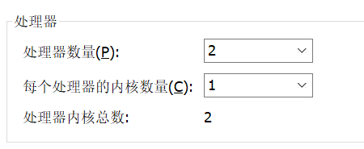
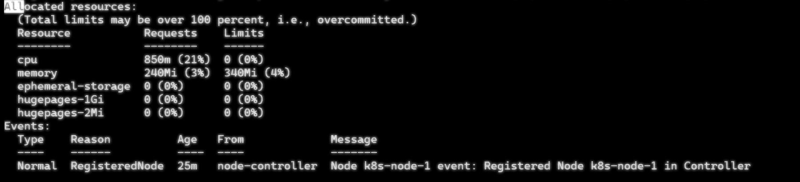
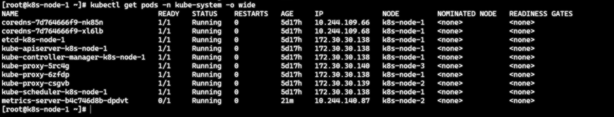
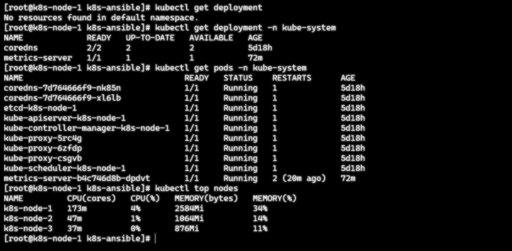
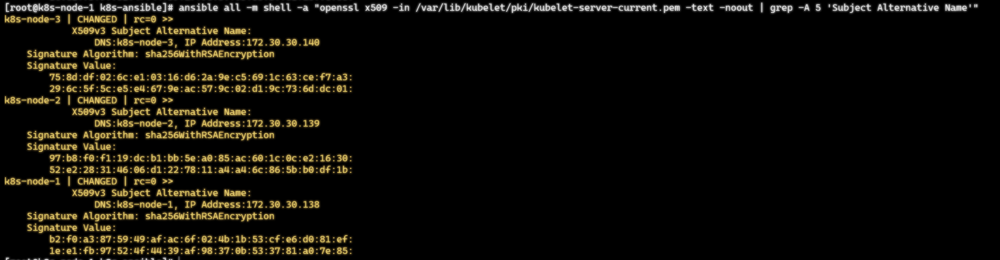
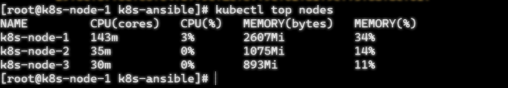

## 现象

早上检查测试环境，新部署的 nginx Pod 卡在 Pending：


当时以为是加了 resource 限制后 CPU 不够。

## 排查 1：资源分配

物理机是 E5-2697 v4，18 核 36 线程：


我原来给每个 VM 只配了 2C4G，实际上这台机器能分出 7 个 4C VM。这是第一个问题：**配少了**。

第二个问题更隐蔽：VMware 里 Socket 和 Cores 的翻译坑。



我原来配的是：
- 处理器数量: 2
- 每个处理器的内核数量: 1

这会让 Linux 以为是 2 路 NUMA，性能差。正确配法是 **Socket=1, Cores=4**，保持单 NUMA 域。

改完配置：


`kubectl describe node` 显示资源正常，Pod 不再 Pending：



## 排查 2：metrics-server 起不来

Pod 能调度了，但 metrics-server 一直 **Not Ready**：


查看 deployment 和 pod 状态：




看 pod 的 Events，是 readinessProbe 检测失败：


看日志，metrics-server 一直在重试连 kubelet：


**根因**: kubeadm 默认生成的 kubelet 证书**只含 hostname，不含 Node IP**。metrics-server 默认用 NodeIP 连 kubelet，证书验证失败：

```
x509: cannot validate certificate for 172.30.30.138 
because it doesn't contain any IP SANs
```

## 修复

所有节点执行：

```bash
cat >> /var/lib/kubelet/config.yaml << 'EOF'
serverTLSBootstrap: true
EOF
systemctl restart kubelet.service
```

然后批准 CSR：

```bash
kubectl get csr
kubectl certificate approve csr-XXXXX
```


## 验证

检查证书是否包含 IP SAN：

```bash
ansible all -m shell -a "openssl x509 -in /var/lib/kubelet/pki/kubelet-server-current.pem -text -noout | grep -A 5 'Subject Alternative Name'"
```




metrics-server Ready 后，`kubectl top nodes` 正常：


