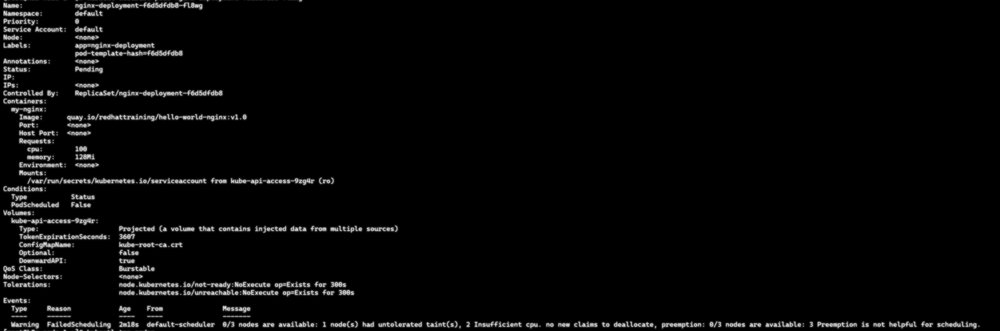
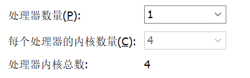
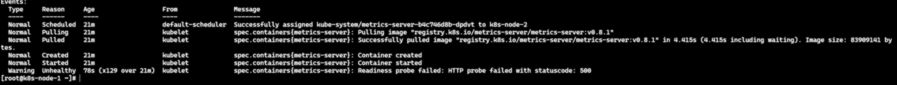
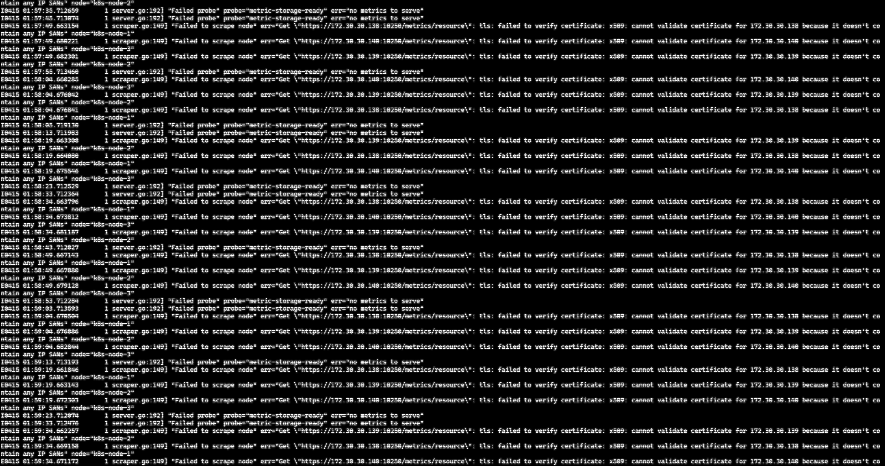
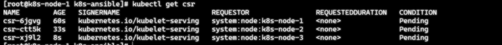
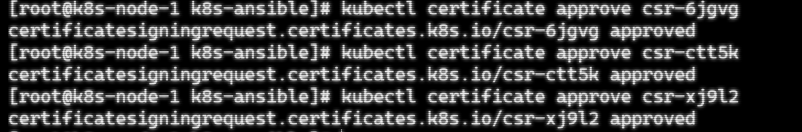

### 现象: 一个看似简单的 Pending

早上例行检查测试环境，发现新部署的 nginx Pod 卡在 Pending：

初步判断：加了resource字段配额后CPU资源不足.

### 第一层：我有多少粮？

排查前先算账。物理机是 E5-2697 v4：

关键认知：
```text
    18 物理核心 × 2 超线程 = 36 逻辑线程（Threads）
    VMware Workstation 单个 VM 最多支持 32 vCPU（软件限制）
    建议分配给所有 VM 的总和：28-32 vCPU（留 4-8 个给 Windows 宿主保活）
```
所以理论上，这台机器可以虚拟出：
```text
    7 个 4C VM（28 vCPU，余量充足）
    或 4 个 8C VM（32 vCPU，摸上限）
    或 1 个 32C 巨兽 VM（Workstation 上限）
```
但我当时配的是 2C4G——相当于拿着 36 个线程，只给 K8S每个节点用了 2 个，剩下的 30 个在 VMware 里干瞪眼。这是第一层"认知饥荒"。

### 怎么盛饭？（VMware 界面陷阱）
知道有 36 线程后，问题变成：如何在 VMware 里正确分配 4C？
这时候才踩到那个 Socket/Cores 翻译坑：

```text
    错误配置(上图)：
    处理器数量(P):              2    ← 以为是2个CPU
    每个处理器的内核数量(C):    1    ← 以为是单核
    → 实际效果：欺骗 Linux 以为是 2 路 NUMA，性能暴跌
```
### 修正资源认知后的配置
```text
    总计可分配: 36 线程
    建议分配:   28 线程（留 8 个给 VMware/Windows 宿主）
    单 VM 配置: 4C8G（Socket=1, Cores=4）

    可跑节点数: 7 个（28÷4=7）
    实际部署:   3 节点（1 Master + 2 Worker，余量充足）
```
关键修正：

```text
    Socket=1：保持单 NUMA 域，避免跨节点内存延迟
    Cores=4：实际分配 4 个逻辑线程（相当于 2 物理核心的算力）
    内存预留 8G：给 ESXi/宿主留足余量，避免 ballooning 抢占
```
改完配置后，`kubectl describe node`显示：

Pod 不再 Pending，资源层问题彻底解决

### 第二层：就绪探针的"假死"现象
资源充足后，成功调度并运行，但一直 **Not Ready**：

使用`kubectl get deployment/metrics-server -n kube-system`发现该deployment状态异常无法ready

查看该deployment的describe Events, 证明异常不在deployment组件上, 则开始排查pod

使用`kubectl get pods -n kube-system`查看该deployment对应pod, 毫不意外ready 0/1.

查看该pod的describe Events信息, 该pod的readinessProbe(就绪探针)检测失败

**陷阱**：看到 500 容易以为是应用崩了，但 kubectl logs 显示进程正在疯狂重试连接 kubelet。


**真相**：

  -  Running ≠ Ready：容器活着，但就绪探针认为"还没准备好接收流量"
  -  HTTP 500 是内部错误：metrics-server 的 /readyz 接口返回 500，因为无法从 kubelet 获取数据（TLS 证书未批准）
  -  21 分钟 × 129 次失败：证书问题导致持续无法就绪，Pod 被隔离在 Service 外
直到手动批准 CSR 后，探针返回 200，Pod 状态才变为 Ready。
### 第三层：kubeadm 的默认证书陷阱
beadm 默认生成的 kubelet 证书**只包含 hostname，不含 Node IP**。

metrics-server 默认使用 **NodeIP**（如 172.30.30.138）连接 kubelet，证书验证失败：

```text
x509: cannot validate certificate for 172.30.30.138 
because it doesn't contain any IP SANs
```
#### 修复:
启用 serverTLSBootstrap 与 CSR 批准
在所有节点输入一遍
```bash
 cat >> /var/lib/kubelet/config.yaml << 'EOF'
 serverTLSBootstrap: true
 EOF
 systemctl restart kubelet.service
 ```
然后批准所有CSR即可
```text
 kubectl get csr
 kubectl certificate approve csr-XXXXX
```


#### 验证修复结果:
```bash
ansible all -m shell -a "openssl x509 -in /var/lib/kubelet/pki/kubelet-server-current.pem -text -noout | grep -A 5 'Subject Alternative Name'"

kubectl get pods -n kube-system
kubectl get describe -n kube-system
```


**验证**`kubectl top nodes`打印节点资源
